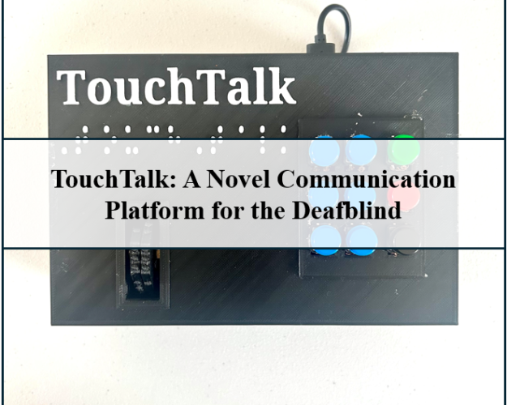

# TouchTalk

## Notes to Viewers
This project is currently in the process of being patented. The code shown here provides only the simplified functional code for the TouchTalk web app. If you are interested in collaboration, please contact [me](mailto:gokaraju07joti@gmail.com). A full project description can be found on [ProjectBoard](https://partner.projectboard.world/ysc/project/touchtalk-an-innovative-communication-platform-for-the-deafblind). 

This project was submitted to the 2024 Canada-wide Science Fair. The project won the Engineering Innovation Award (Best Engineering Project) from the Engineering Institute of Canada and the Canadian Society for Senior Engineers, a Senior Gold Medal, the Best Senior Health and Wellness Project Challenge Award, and a Youth Can Innovate Grand Award. 

This project was developed independently with mentorship from the [Saskatchewan Alternate Format Materials Library](https://www.spsd.sk.ca/division/SAFM/Pages/default.aspx#/=), the [Canadian Deafblind Association](https://www.cdbanational.com/), the [Canadian National Institute for the Blind](https://www.cnib.ca/en?gad_source=1&gclid=Cj0KCQjwvpy5BhDTARIsAHSilynFJHknwidSajT9dd0suPEP1YpwvKr-0KZkfF9aY6pd9ZOTWRkIaZYaAp8pEALw_wcB&region=on), and teachers from [Walter Murray Collegiate](https://www.spsd.sk.ca/school/waltermurray/Pages/default.aspx#/=). 

TouchTalk was featured on [CBC Saskatchewan](https://www.cbc.ca/listen/live-radio/1-88-saskatoon-morning/clip/16100153-saskatoon-high-school-student-creates-innovative-idea-help).
## Process Explanation
The TouchTalk platform integrates a web application with a physical device to facilitate communication for Deafblind individuals. A logic diagram is provided in Figure 10, and a simple video description is attached at the end.

### Text Generation on the App
1. Non-disabled users access the online app and record their voices using integrated microphones. The app transcribes the recording using speech-to-text models.
2. The transcribed text undergoes sentiment analysis to detect tone and tags are appended accordingly.
3. Users can also utilize image-to-text conversions. Image captioning models leverage built-in cameras to generate descriptions, while optical character recognition processes handwritten text.
4. Conversion to Braille
5. Upon completion of transcription, users can convert the text to Braille by clicking the "Convert" button.
6. The "Send" button converts each Braille letter to [X, Y] instructions for motor movement.

### Cloud File Communication
1. The app writes the [X, Y] instructions onto a private file in a GitHub repository using Wi-Fi.
2. The device checks for updates on the GitHub file every 1.5 seconds. If a change is detected, the JSON data is loaded as a list for use.

### Braille on the Device
1. Stepper motors move according to [X, Y] instructions to display Braille letters, pausing for three seconds after each movement.
2. DeafBlind users respond using a Braille keyboard. The 2x3 array on the keyboard represents the braille cell. Users press the green button to set a new letter and enter the braille configuration on the array. Pressing the red button converts all the button arrangements into Braille and writes it to the GitHub cloud file. 

### Translation and Output
1. The app checks for updates on the GitHub cloud file and translates Braille input from the device into English/French. The text is displayed on the app, along with an audio recording of the translation.
2. Deafblind users can press the black button on the keyboard to provide English/French audio output of the typed Braille directly from the device.

## Hardware Specifications
The TouchTalk device is controlled by a Raspberry Pi 3B+, two ULN2003 stepper motor drivers, two 28BYJ-48 stepper motors, and nine push buttons. Two 3D octagonal discs to represent the braille characters and a flat board to attach the buttons for the braille keyboard were fabricated. A mini USB speaker for audio output was also added to the device and connected to the Raspberry Pi. A 3D-printed case to house all the components was designed and created. The device operates independently and does not require peripherals. The total cost of TouchTalk is $97.70.

## Software Specifications
The app was built for free on the Streamlit web-hosting platform. Parallel software was developed for both English and French use cases. Machine learning models were uploaded using Hugging Face pipelines and cached to fit the 8 GiB server constraints. Communication between the app and the device was implemented by uploading commands onto two private GitHub files over Wi-Fi. All conversation logs are deleted after refreshing the app to ensure privacy and prevent data leaks.

